# 🏭 Autonomous AI Engineering Organization

> Describe an app idea in plain English — a pipeline of specialized LLM agents
> interviews you, architects the system, **writes the code, security-reviews it,
> tests it on an ephemeral instance, and deploys a working, isolated app** — end
> to end.


**At a glance:** ~15.7k lines of backend Python across 68 modules · **10 specialized agent stages** ·
**40+ deterministic integrity gates**, each grounded in a real captured failure · **~9.7k lines of
LLM-free tests** (19 suites) · 19-table schema · multi-provider LLM orchestration with per-stage cost routing.

---

## The interesting part: a Code Integrity Engine

LLMs are non-deterministic — a fresh generation trips over a *different* one-off bug
every time (a hallucinated package, a wrong import, a truncated file, a renamed
schema column). The core engineering idea here is to **stop trusting the LLM output
and start verifying it**:

> A layer of **deterministic, no-LLM gates** validates generated code at every
> stage. Each gate detects a precise defect (via AST analysis, symbol tables,
> real `pip`/boot probes…), feeds a **targeted repair** back to the agent, and
> retries — so a one-off mistake is **caught and self-healed instead of shipped.**

Every one of the 40+ gates was grounded in a **real failure captured from a live
run**, then locked in with a regression test. A few examples:

| Gate | Catches | How |
|---|---|---|
| Symbol resolution | `from app.auth import require_admin` when it doesn't exist | AST symbol table across the whole build |
| Hallucinated package | `from starlette_limiter import Limiter` (no such PyPI package) | offline blocklist + ground-truth `pip install` |
| Frontend truncation | an LLM output cut off mid-JSX (unbalanced braces) | structural brace/string parse, Node-free |
| Duplicate routes | `POST /orders` defined in two route files | route-ownership map |
| HTTP-exception swallow | a `get_db` that turns every 401/404 into a 500 | AST of the dependency generator |
| Fail-closed security | deploying code the security review never certified | content-fingerprint drift check |

## How it works

```mermaid
flowchart LR
    U(["User: build me an app"]) --> BA[BA Interview]
    BA --> PI[Product Intelligence]
    PI --> AR["Architect<br/>blueprint + sprint tickets"]
    AR --> DEV[Developer Agents]
    DEV --> CIE{{"Code Integrity Engine<br/>deterministic gates"}}
    CIE -. "repair + retry" .-> DEV
    CIE --> SB[smoke-boot gate]
    SB --> SEC["Opus Security Review<br/>(fail-closed)"]
    SEC --> QA["QA<br/>ephemeral boot + HTTP tests"]
    QA --> DO["DevOps<br/>isolated deploy + HTTPS"]
    DO --> APP(["🚀 Live app"])
```



- **BA agent** — conversational interview capturing the idea, audience, budget,
  and design vibe; runs live competitive research.
- **Product Intelligence** — a review gate that turns the raw requirements into a
  product read + recommendations before anything is built.
- **Architect** — produces a blueprint (tech stack, DB schema, API endpoints,
  wave-scheduled sprint tickets). Deterministic Python owns the fixed rules; an
  LLM fills the creative parts.
- **Developer agents** — generate the application code ticket-by-ticket, behind
  the Code Integrity Engine's build gate.
- **smoke-boot gate** — assembles the app in a throwaway venv and boots it (no
  LLM). Code that can't even start never reaches the expensive security review.
- **Code Reviewer** — a general pass **plus a real Claude Opus security review**
  that must certify the code (fail-closed) before deploy.
- **QA** — provisions an ephemeral database, boots the app, and runs real HTTP tests.
- **DevOps** — assembles images and deploys an **isolated per-project Docker stack**
  with HTTPS (Caddy), injects secrets, and health-checks the live URL.
- **Documentation** — generates a user guide + demo material from the finished build.

**Owner onboarding is first-class:** the platform provisions the operator-facing
integrations at build/deploy time — **Stripe Connect** (click-to-connect OAuth),
**per-project Auth0 apps** (Management API), and **email/SMTP** — and wires the
generated app to consume them.

## Tech stack

| Layer | Tech |
|---|---|
| **Backend** | Python 3.12, FastAPI (async), SQLAlchemy async, Alembic, Pydantic |
| **Data** | PostgreSQL, Redis |
| **Frontend** | React, Next.js (App Router), TypeScript |
| **AI** | OpenAI (GPT-4o) · Anthropic (Claude Opus for security review, vision for menu extraction) · Google Gemini — routed per stage for cost |
| **Infra** | Docker & Docker Compose, Caddy (automatic HTTPS), isolated per-project stacks; AWS/Route53 deploy path scaffolded |

## What this project demonstrates

- **AI systems engineering** — multi-agent orchestration, prompt/contract design,
  per-stage model routing for cost, and treating LLM output as *untrusted* behind
  deterministic verification.
- **Backend depth** — async FastAPI + SQLAlchemy, a 19-table schema, background
  jobs, cost tracking, and a clean stage-based pipeline API.
- **DevOps / platform** — containerized isolated deploys, automatic HTTPS,
  ephemeral test environments, secret provisioning, fail-closed security gating.
- **Engineering rigor** — ~9.7k lines of deterministic, LLM-free tests; every fix
  grounded in a real captured failure and locked with a regression test.
- **Product integrations** — Stripe Connect, Auth0 (Management API), SMTP email.

## Run it

```bash
cp .env.example .env    # then add the API keys you have
docker compose up -d
```

- Frontend → http://localhost:3000
- Backend health → http://localhost:8000/health → `{ "status": "ok" }`
- API docs (OpenAPI/Swagger) → http://localhost:8000/docs

The backend runs `alembic upgrade head` on startup. Real code generation and the
Opus security review need the matching keys in `.env` (`OPENAI_API_KEY`,
`ANTHROPIC_API_KEY`, `GEMINI_API_KEY`, …). `.env` is gitignored — never commit real keys.

## Testing

The Code Integrity Engine is covered by deterministic, LLM-free offline suites
(architect, developers, QA, devops, onboarding, smoke-boot, venv-pinning, …) — no
API spend, no Docker daemon required for most:

```bash
docker compose run --rm --no-deps -e PYTHONPATH=/app -v "$PWD/backend:/app" \
    backend python tests/test_developers_offline.py
```

## Project structure

```
backend/app/
  main.py            FastAPI app: conversation + /pipeline/* stage endpoints
  config.py          Settings from env
  llm.py · codegen.py · providers.py · usage.py   LLM routing, generation, cost tracking
  models.py          19 DB models (projects, blueprints, generated_files, deployments, …)
  ba/                Business Analyst interview agent
  product_intel/     Product Intelligence review gate
  architect/         Blueprint builder (stack, schema, endpoints, sprint tickets)
  developers/        Developer agents + the Code Integrity Engine build gate
  qa/                Ephemeral assemble → boot → HTTP-test
  reviewer/          Code review + Opus security certification (fail-closed)
  devops/            Deploy: manifest, sizing/cost, isolated stack, HTTPS, secrets
  onboarding/        Owner onboarding: Stripe Connect, Auth0, email
  documentation/     User guide + demo generation
  background/        Monitoring, cost checks, summaries
  alembic/           Migrations
frontend/            Next.js App Router UI
docker-compose.yml   backend · frontend · postgres · redis
```

## Pipeline API (per project)

`POST /conversation/start` → `/conversation/message` (BA interview) →
`POST /pipeline/review` → `/pipeline/start` (architect) → `/pipeline/build` →
`/pipeline/secure` → `/pipeline/qa` → `/pipeline/deploy` → `/pipeline/document`,
each with a matching `GET /pipeline/{id}/…-status`.

## License

Released under the [MIT License](LICENSE).

---

<sub>Status: an independently-built research & portfolio project. The pipeline
reliably runs end-to-end to a **live local deploy** (isolated per-project Docker
stack over HTTPS); the AWS/Route53 path is scaffolded, with local as the supported
target.</sub>
